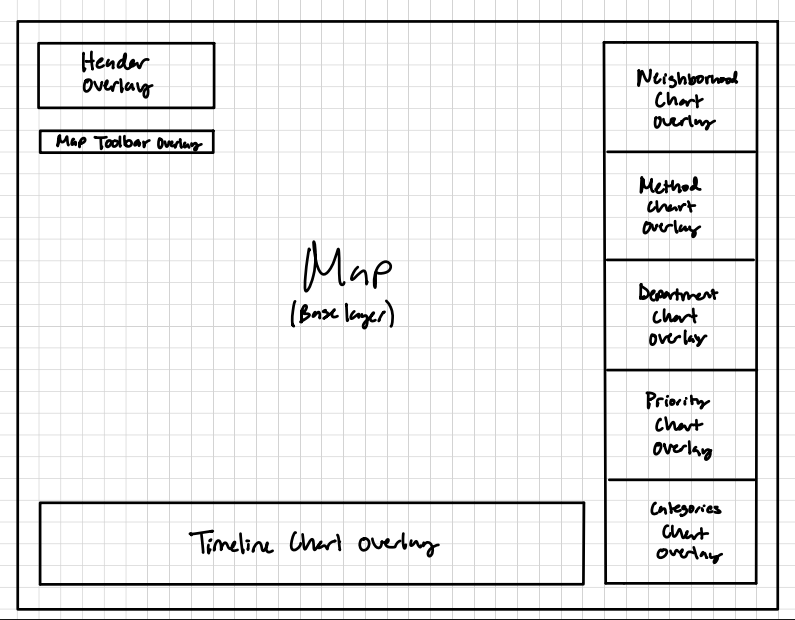

# Who You Gonna Call? 3-1-1\!

An interactive data visualization application for exploring Cincinnati's 311 non-emergency service request data. Built with D3.js and Leaflet as part of CS 6024 Project 2\.

Live Application: [https://project-2-chi-three.vercel.app/](https://project-2-chi-three.vercel.app/)  
Source Code: [https://github.com/Aniketbhanderi/Project-2](https://github.com/Aniketbhanderi/Project-2)

---

## Motivation

Cities receive thousands of non-emergency service requests every year — potholes, illegal dumping, broken streetlights, and more. These calls tell a story about which neighborhoods need the most attention, which agencies handle the most work, and how quickly the city responds. But raw spreadsheets make those patterns invisible.

This application lets anyone explore Cincinnati's 311 data interactively. By combining a geographic map with linked charts and a brushable timeline, it allows a user to ask and answer questions like: *Which neighborhoods make the most requests? Are certain types of calls concentrated in specific parts of the city? Does call volume spike at particular times of year? Are high-priority requests being resolved quickly?* All visualizations update together in real time, so insights that would take hours to find in a spreadsheet emerge in seconds.

---

## The Data

**Source:** [Cincinnati 311 Non-Emergency Service Requests](https://data.cincinnati-oh.gov/efficient-service-delivery/Cincinnati-311-Non-Emergency-Service-Requests/gcej-gmiw/about_data) — City of Cincinnati Open Data Portal

The dataset contains records of all 311 service requests submitted to the City of Cincinnati. Each record includes the type of service requested, the date and time the call was received, the date it was last updated or resolved, the responding city department, the neighborhood, the priority level, the method through which the request was submitted (phone, web, app, etc.), and GPS coordinates for most requests.

For this application we loaded a representative random sample of **5,000 rows** preprocessed from the full dataset. This sample covers all service request types rather than focusing on a single category, giving a broad view of city operations. A small number of records are missing GPS coordinates; these are excluded from the map but are still counted and surfaced across all the attribute charts.

**Key fields used:**

- `SR_TYPE` — the type of service requested  
- `DATE_CREATED` / `DATE_CLOSED` — request and resolution timestamps  
- `LATITUDE` / `LONGITUDE` — geographic location  
- `NEIGHBORHOOD` — Cincinnati neighborhood  
- `PRIORITY` — priority level assigned by the city  
- `DEPT_NAME` — the city department handling the request  
- `METHOD_RECEIVED` — how the request was submitted

---

## Sketches

Before writing any code, the team sketched a layout and visual hierarchy for the application. Our core design question was: *how do we let the map dominate, while still giving attribute charts enough room to be readable?*

Our initial sketch placed the interactive Leaflet map as a full-viewport background layer, with a narrow left-side control panel for filters and color options, a right-side column of small attribute charts, and a bottom-anchored timeline spanning the width of the map. This layout allowed the geographic view to stay primary while keeping all analytical charts visible without scrolling.

---

## Visualization Components

### Interactive Map

The centerpiece of the application is a zoomable, pannable map of Cincinnati built with Leaflet and rendered with D3.js SVG overlays. Each 311 service request with valid GPS coordinates appears as a colored circle on the map. The map automatically fits to the data extent on load so Cincinnati fills the viewport immediately.

**Color by options** — A dropdown in the left panel lets you choose what the point colors encode:

- **Time from Request to Update** — a sequential yellow-orange-red (`YlOrRd`) color scale maps how many days elapsed between the request date and the last update date. This is a quantitative variable, so a sequential monochromatic scheme is appropriate: yellow indicates fast resolution and deep red indicates slow resolution.  
- **Neighborhood** — a 32-color categorical palette assigns a distinct hue to each Cincinnati neighborhood. Neighborhood is a nominal variable (no meaningful order), so a categorical scheme with maximally distinct colors is correct.  
- **Priority** — a fixed ordinal color map encodes the city's priority levels (Emergency, High, Medium, Low, etc.) using colors ordered intuitively from urgent (red) to routine (blue). Priority is ordinal, so the colors reflect that ranking.  
- **Public Agency** — the same 32-color categorical palette used for neighborhoods assigns a unique color to each responding city department. Agency is nominal, so a categorical scheme applies.  
- **Service Request Type** — another categorical encoding, using the same extended palette to differentiate among the many service types in the dataset.

**Call density color scheme** — The bar charts, neighborhood heatmap tiles, and city heatmap overlay all use a shared sequential **yellow-green-blue** (`YlGnBu`) color scale to encode the count (density) of service requests. Count is a quantitative variable, so a sequential scheme is appropriate: light yellow represents few requests and deep blue represents many. A square-root normalization is applied to the scale domain so that color contrast is distributed more evenly across skewed distributions where a handful of categories dominate, preventing the majority of bars or tiles from appearing a uniform light yellow.

**Custom color picker** — The categorical color encodings support per-category color overrides. Clicking any swatch in the active color legend opens a native color picker, letting you reassign any individual category (e.g., a specific neighborhood, agency, or priority level) to any color you choose. A Reset button restores the default palette for that encoding. This is useful for highlighting a particular category of interest or for producing screenshots with colors that match a presentation theme. Overrides are stored in the global state and persist across filter changes for the duration of the session.

**Basemap toggle** — A button switches between two Esri tile layers: **Aerial** (satellite imagery, useful for identifying physical features) and **Street Map** (road and boundary lines, useful for reading neighborhood structure). The toggle is persistent and does not reset the filter state.

**Details on demand** — Clicking any point on the map highlights it and displays all of its fields in the Selected Data Point panel in the left sidebar, including the SR number, type, dates, agency, neighborhood, priority, and method received.

**Missing GPS indicator** — The left panel displays a count of how many points are currently visible, while the Request Type Selection Filter displays how many points there actually are.

---

### Timeline

A brushable chart along the bottom of the screen shows the number of 311 requests binned by day over the full date range of the dataset. A dropdown lets you toggle between plotting by **Date Received** (when the call came in) or **Date Resolved** (when it was closed).

The x-axis is a time scale with labeled ticks; the y-axis shows request count. Hovering over any bar shows a tooltip with the day's date and exact count.

**Brush to filter** — Click and drag across the timeline to select a date window. All other visualizations (map, attribute charts) immediately update to show only the records within that window. Drag the handles to resize the selection.

**Animate** — The Play button animates a 15-day sliding window forward through time, updating all linked views as it moves. The Stop button pauses the animation, leaving the current window selected so you can explore it. Reset clears the date selection.

---

### Attribute Charts (right panel)

Five charts in the right panel each provide a dedicated view of a key categorical attribute. All five update together whenever any filter changes.

**Top Service Request Types** — A horizontal bar chart showing the top 10 service request types by count. Bars are clickable: clicking a bar (or multiple bars) filters all other views to show only those request types. Clicking a selected bar deselects it.

**By Priority** — A pie chart showing the proportion of requests at each priority level. Clicking a slice filters all other views to that priority. The color scheme uses the same fixed ordinal priority colors as the map.

**By Agency** — A horizontal bar chart showing which city departments handle the most requests. Clicking a bar cross-filters all views to that department.

**By Method Received** — A horizontal bar chart showing how requests were submitted (phone, web, mobile app, walk-in, etc.). Clicking a bar filters all other views.

**By Neighborhood** — A proportional tile/heatmap grid where each tile represents a Cincinnati neighborhood, and a color determined by the number of requests. Clicking a tile filters all other views to that neighborhood.

All five charts use a **faded vs. highlighted** approach when selections are active: unselected categories fade to a low opacity rather than disappearing, so you can always see the full distribution while the selected subset is emphasized.

---

### City Heatmap Overlay

A **City Heatmap** button in the left panel overlays a grid-based density heatmap on top of the Leaflet map. The city is divided into a regular grid, and each cell is colored by the density of service requests within it. This provides a population-level overview of where calls are concentrated without the visual clutter of thousands of individual points. The heatmap updates in response to all active filters.

---

### Filter Panel & Cross-Linking

All views in the application are **fully linked**. Any selection or filter — whether by clicking a chart bar, brushing the timeline, brushing the map, or choosing a service type from the dropdown — propagates to every other view simultaneously through a shared global state object. The "Clear Selection" button resets all filters at once.

A **"Brush Map"** button enables a rectangular lasso tool on the map itself. Draw a rectangle over any area, and all attribute charts and the timeline immediately update to reflect only the requests within that geographic bounding box.

---

## What the Application Enables You to Discover

This application helps you understand Cincinnati’s 311 service request data in a simple and visual way. Instead of looking through thousands of rows in a spreadsheet, you can quickly see patterns and trends just by interacting with the dashboard.

First, you can discover where problems are happening in the city. The map shows every request as a point, so you can easily see clusters of activity. This helps you notice which neighborhoods have more issues and which areas have fewer requests. Turning on the heatmap makes these patterns even clearer.

You can also explore what kinds of problems are most common. The charts on the right show the top service request types, which departments handle them, and how people report them. This helps you understand what the city deals with the most, like potholes, trash, or other issues.

The timeline helps you see when requests happen. You can look for spikes, busy periods, or slow times during the year. By selecting a time range or using the play feature, you can watch how activity changes over time and see if certain issues happen more during specific periods.

Another thing you can learn is how the city responds to requests. By coloring the map based on time to update, you can see which requests are handled quickly and which take longer. This gives insight into how efficient different services might be.

You can also compare priority levels and how requests are submitted. For example, you can see if most requests are standard or urgent, and whether people use phone calls, websites, or apps more often.

The most powerful part is that everything is connected. When you click or filter one thing, everything else updates instantly. This means you can ask more detailed questions, like:

* What problems happen most in a specific neighborhood?  
* Where are high-priority requests concentrated?  
* How do request patterns change over time in one area?

Overall, the application makes it easy to explore the data from different angles and find useful insights quickly. It helps turn complex data into something clear and understandable, so you can better see how the city is functioning and where improvements might be needed

---

## Process

### Libraries

- [**D3.js v6**](https://d3js.org/) — all SVG rendering, scales, axes, brushes, and data binding  
- [**Leaflet.js**](https://leafletjs.com/) — interactive map tiles and projection  
- **Esri tile layers** — aerial imagery and street map basemaps via ArcGIS Online

### Code Structure

The codebase is organized as a set of independent class-based modules, each responsible for one view:

index.html              — page layout and script loading

js/

  main.js               — global state, data loading, app initialization, animation

  leafletMap.js         — Leaflet map \+ D3 SVG overlay, color scales, map brush

  timelineChart.js      — brushable bar chart timeline

  neighborhoodHeatmap.js — neighborhood tile/heatmap view

  priorityPieChart.js   — priority pie chart

  barChart.js           — reusable horizontal bar chart (used for SR type, agency, method)

  cityGridHeatmap.js    — city-wide density grid overlay on the map

  filterPanel.js        — left-side control panel (dropdowns, buttons, selected-point display)

  d3.v6.min.js          — D3 library (local copy)

  leaflet.js            — Leaflet library (local copy)

css/

  style.css             — global layout

  \[component\].css       — per-component styles

data/

  311\_sampled\_5000.csv  — preprocessed 5,000-row sample used at runtime

A central `globalState` object in `main.js` holds all active filter selections (service type, neighborhoods, priorities, agencies, methods, date range, brushed map points, color-by mode, etc.). Every user interaction calls `setGlobalState()`, which triggers a single `updateApp()` function that fans out to update every chart and the map in the correct dependency order. Each chart sees all active filters *except its own dimension*, so its own elements remain visible (faded vs. highlighted) rather than disappearing — this is the "cross-filter" pattern.

### Running Locally

1. Clone the repository:  
     
   git clone https://github.com/Aniketbhanderi/Project-2  
     
   cd Project-2  
     
2. Serve the directory with any static server. For example:  
     
   \# Python 3  
     
   python \-m http.server 8000  
     
   \# or Node  
     
   npx serve .  
     
3. Open `http://localhost:8000` in your browser.

No build step or package installation is required.

### Live Application

The application is deployed at: **https://project-2-chi-three.vercel.app/**  
---

## Demo Video

Live Demo: [https://youtu.be/W4HBFSfghp8](https://youtu.be/W4HBFSfghp8)

The demo walks through: loading the application, using the color-by dropdown, toggling basemaps, clicking attribute charts to cross-filter, brushing the timeline, using the map brush, and the timeline animation feature.

---

## Challenges and Future Work

### Challenges

**Performance at scale.** Rendering thousands of SVG circle elements on a Leaflet overlay can become sluggish at low zoom levels when all points overlap. We addressed this by working with a 5,000-row representative sample rather than the full dataset, and by minimizing unnecessary re-renders in the update cycle. Even with the sample, the initial render and re-renders on filter change required careful profiling (the app logs timing information to the browser console) to identify and eliminate bottlenecks.

**Stable color scales during cross-filtering.** When a user clicks a chart to filter, the color scale used for "color by neighborhood" or "color by agency" would naively recompute its domain from the filtered subset, causing colors to shift and making comparisons confusing. We solved this by separating the data used for color scale computation (type-filtered only) from the data used for rendering (fully filtered), so colors remain stable across interactions.

**Brush and map interaction conflict.** Enabling a D3 brush overlay on the map required disabling Leaflet's built-in drag and scroll zoom while brushing is active, then re-enabling them when brush mode is turned off. Coordinating these two interaction layers cleanly required careful event handling.

### Future Work

- **Trend lines and statistics.** Overlaying a moving average or comparing year-over-year trends in the timeline would add analytical depth.  
- **More granular time bins.** Currently the timeline bins by day. A toggle between daily, weekly, and monthly bins would give users more control.

---

## Use of AI and Collaboration

Our team used AI as a collaborative development tool. It assisted in answering boilerplate/structural questions, debugging complex logic, and refining thematic styling. We reviewed all AI-generated code before incorporating it.

---

## Who Did What

| Team Member | Contributions |
| :---- | :---- |
| **Taylor** | Data Preprocessing, Layout Design and Implementation, Request Method Chart, Service Department Chart, Service Request Type Chart, Linked Interactions and Chart Tooltips, Color by Filter color schemes, Charts/Heatmap Color Schemes, Chart Color Scheme Legends, Custom Color Picker, Documentation, Live Demo Video |
| **Aniket** | Initial Map Set-up, Filter Panel Set-up, Map Tooltips, Timeline, Priority Chart, Neighborhood Chart, Linked Interactions and Chart Tooltips, Heatmap, Timeline Animation, Live Deployment |
| **Steven** | Map Brushing |
| **Vaish** | Timeline, Parts of Documentation |

---

*CS 6024 | Project 2 | Spring 2026*  
